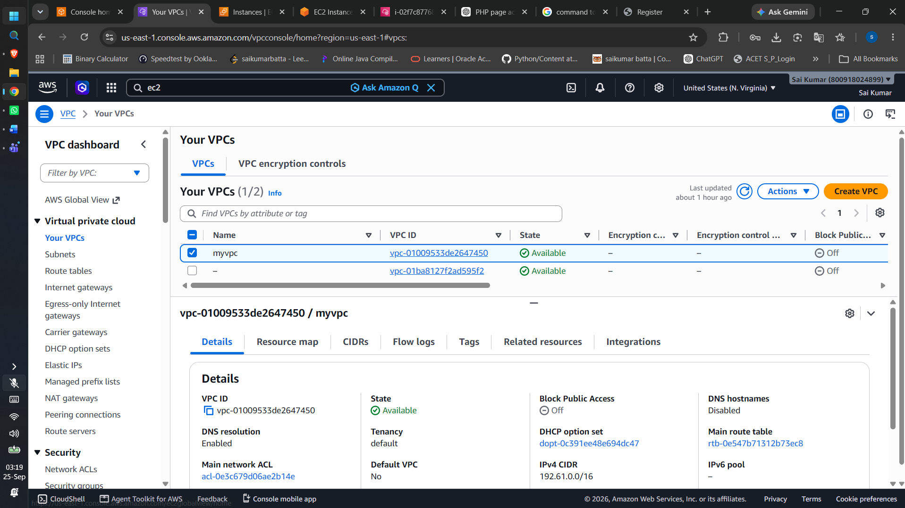
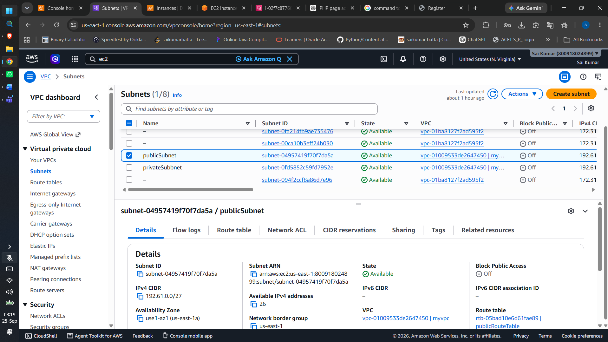
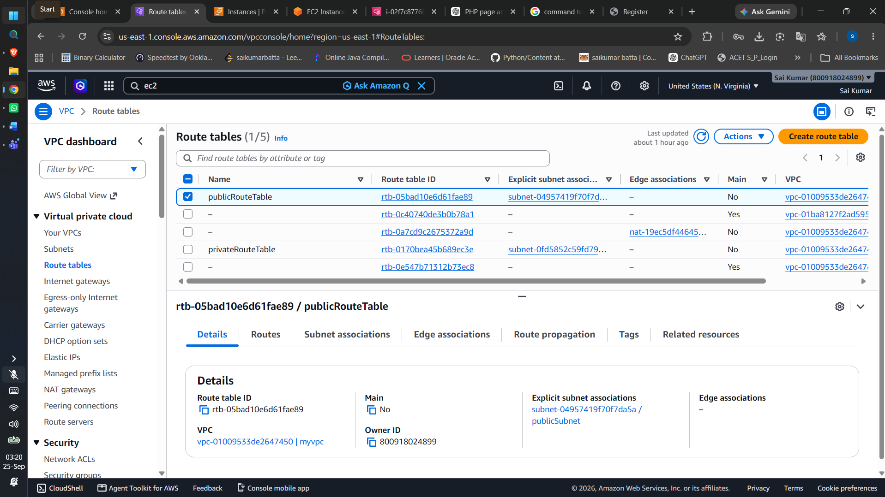
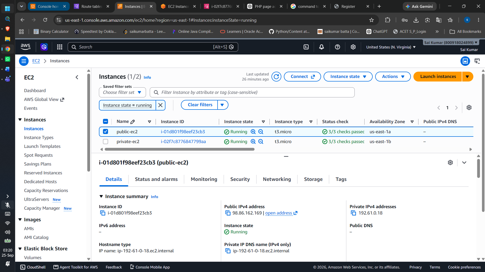
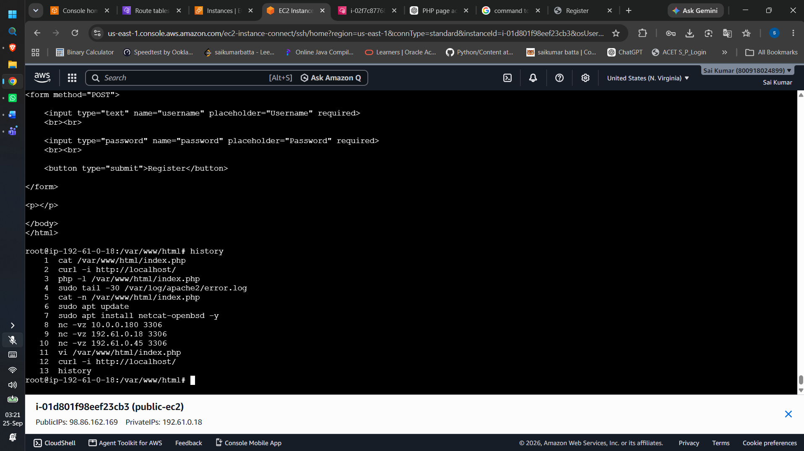
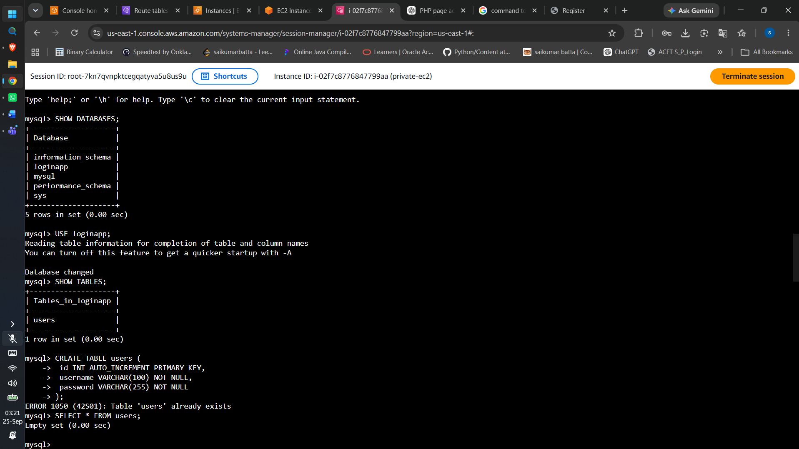
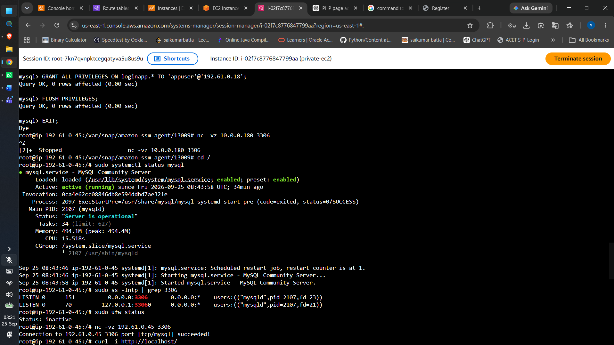
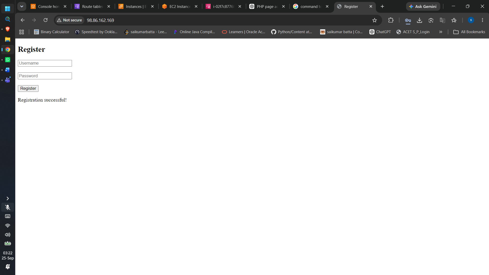
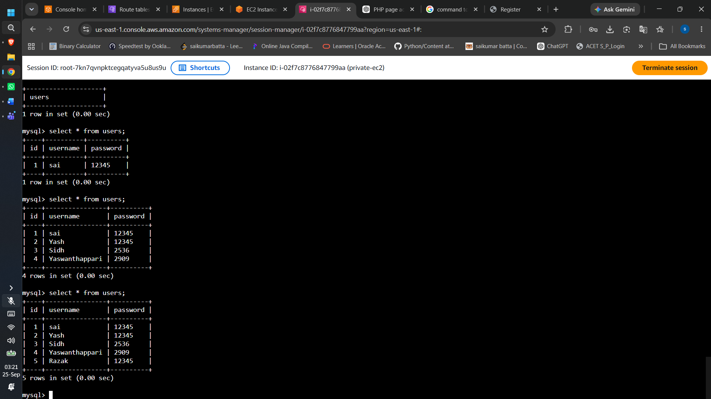

# Deploying a Two-Tier Web Application on AWS

This repository demonstrates how to deploy a scalable, two-tier web application architecture using AWS (Amazon Web Services). The deployment utilizes core networking and compute services including Amazon Virtual Private Cloud (VPC) and Amazon Elastic Compute Cloud (EC2) to separate the web front-end from the database backend for enhanced security.

Below is a step-by-step walkthrough of the entire deployment process.

---

## 1. Creating a VPC
First, we set up an Amazon Virtual Private Cloud (VPC) to define a logically isolated network for our application. This provides complete control over our virtual networking environment, including resource placement, connectivity, and security.

## 2. Creating Subnets
Within the VPC, we create distinct subnets. A public subnet is created for our web server (which needs internet access to serve users), and a private subnet is created for our database (which should remain isolated from direct internet access for security).

## 3. Configuring Gateways and Route Tables
To enable internet connectivity for the public subnet, we attach an Internet Gateway (IGW) and update the public route table. To allow our private database server to download updates without exposing it to inbound internet traffic, we set up a NAT Gateway and configure the private route table accordingly.

## 4. Launching Public and Private Instances
We launch two Amazon EC2 instances. The first is a public instance launched into the public subnet to act as our web server. The second is a private instance launched into the private subnet, which will host our database.

## 5. Setting up the Public Instance (Web Server)
Once the public instance is running, we connect to it, perform system updates, and install the necessary software stack. This includes updating the package index and installing Apache2 and PHP to serve our web application.

## 6 & 7. Setting up the Private Instance (Database)
For the backend, we connect to our private EC2 instance and install MySQL. We then secure the installation, log into the database, create a new database, and set up a table to store user registration data.

## 8. Registration Page Interface
Here is the front-end user interface of our application. This page is served by the Apache web server on our public instance, presenting users with a registration form.

## 9. Form Submission Confirmation
After a user fills out the registration form and clicks submit, the application communicates with the backend database. This is the interface shown upon successful submission.

## 10. Verifying Data in the Database
Finally, we log back into the MySQL database on the private instance and query the table to verify that the user's registration data was successfully transmitted from the web server and securely stored in the database.

